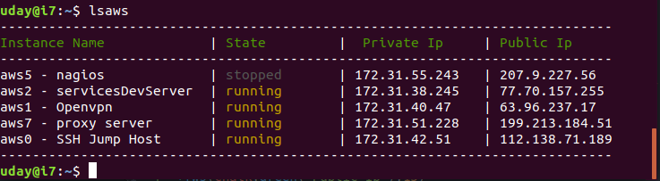

# Aws Scripts
Random aws nodejs scripts I that wrote to make my life easy while tinkering with aws. Feel free to look around, you might find some thing useful :)

## Installation
- Prerequisite Steps
  - Setup **nodejs** *(latest version)*  (please refer to installation instructions for your os flavor )
  - Setup **aws javascript sdk** for nodejs *(latest version)* [AWS Docs]( https://docs.aws.amazon.com/sdk-for-javascript/v2/developer-guide/installing-jssdk.html)
  - **configure aws credentials** file with a account with access to EC2 & VPC
      - Note : here a limited access account is optional and a added security measure and out of scope for this. you can refer to aws docs on how to create it.
      Here the aws [documentation](https://docs.aws.amazon.com/sdk-for-javascript/v2/developer-guide/loading-node-credentials-shared.html) on configuring aws credentials for sdk usage

- Clone this project in to your home directory & build (Type below commands in a linux terminal)
```
cd ~
mkdir git
cd git
git clone https://github.com/udaygin/aws_scripts.git
cd aws_scripts
npm install
```
*Note : for the rest of the document, I am going assume that you cloned this project into `~/git` directory as in above snippet. if not, not please adjust below commands to match the location of the project in your machine.*   
- Update your `~/.bashrc` and reload it
*Note : if you are using some other file like `~/.bash_aliases` instead of `~/.bashrc` on your machine for managing bash aliases, please substitute that name instead of `~/.bashrc` in below commands*
```
echo "alias lsaws='node ~/git/aws_scripts/lsaws.js'" >> ~/.bashrc
echo "alias modsgip='node ~/git/aws_scripts/modsgip.js'" >> ~/.bashrc
source ~/.bashrc
```

- Update aws region (replace your_region with your actual region in below command )
```
sed -i 's/us-east-1/your_region/g' ~/git/aws_scripts/lsaws.js
```

## Commands & Usage

## *lsaws* (List aws instances)
##### Description :
list aws instances in your account in a tabular form in command line along with ip addresses and running state. Purpose of this is to get the details that you usually need frequently (like ip and state) with out logging in to aws console every time.
##### Usage :
open a terminal and type below command
```
lsaws
```
sample output



## *modsgip* ( Modify aws SecurityGroup IP )

##### Description :
update aws security group IP to allow ssh only from your public ip. this script is a work in progress. You can use this manually or in automated way to update your aws security group to allow ssh only from your public ip that is provided by your isp. this helps in reducing the number of IPs that can connect to your aws instance.

##### Prerequisite Steps :
- Create a security group "Allow Ssh From My Home Pc Only" with no rules and assigne it to your linux instance to which you want to connect using ssh. note down its security group id which is in the format sg-xxxxxx
- Update the security group in the script to update(replace **your_sg** with your actual SecurityGroup in below command before running).
```
sed -i 's/sg-000000/your_sg/g' ~/git/aws_scripts/modsgip.js
```

##### Usage :
- ##### Manual invocation:
open a terminal and type below command
```
modsgip
```
it will simply update the configured aws security group to allow your public IP to ssh .

- ##### Automatic invocation:
Automatic invocation of this script every time when you run ssh command. this can come in handy if your ISP gives you a NAT ip and uses a pool of public facing IPs and you forget to manually run it every time this so called ip changes.
  - ###### Configuration:
    **__Note : This is a bit of elobarate setup but worth the time w.r.t productivity gains in the longrun__**

    open your ~/.ssh/ssh_config and setup a entry for your ssh server(s)

    *which looks like below entry but by replacing all 3 values below(ec2-user will be same ifyou are also using aws amazon linux. but if not, please update that also with the acutal user name that you login with).*
```
Host blogserver
  User ec2-user
  Hostname 43.85.51.239
  IdentityFile ~/keys/blogserver.pem
```
open your ~/.bashrc and add below contents and use source command to reload
```
sshaws(){
node ~/git/aws_scripts/modsgip.js
ssh $1
}
source ~/.bashrc
```
  - ###### Execution:
  use the previously defined macro instead of regular ssh command
```
sshaws blogserver
```
or like below when you dont have a entry for this server in your ~/.ssh/ssh_config file
```
sshaws -i ~/keys/blogserver.pem 43.21.17.31
```
